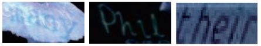
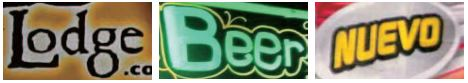
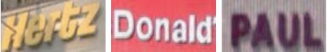

# Scene Text Recognition Recommendations 
<h1 align="center">
     
    
</h1>

<h4 align="center">Everything about Scene Text Recognition</h4>

   <strong><a href="#sota">SOTA </a></strong> •
   <strong><a href="./papers.md">Papers </a></strong> •
   <strong><a href="./datasets.md">Datasets </a></strong> •
   <strong><a href="#code">Code </a></strong>•
   <strong><a href="Framework/main.md">Our Framework </a></strong>

## Contents
- [1. Papers](#1papers)
- [2. Datasets](#2-datasets)
  - [2.1 Synthetic Datasets](#21-synthetic-datasets)
  - [2.2 Benchmarks](#22-benchmarks)
- [3. Public Code](#3-public-code)
  - [3.1 Frameworks](#31-frameworks)
  - [3.2 Algorithms](#32-algorithms)
- [4. SOTA](#4sota)
----
## Checkout Our New Work！
[Revisiting Scene Text Recognition: A Data Perspective](https://github.com/Mountchicken/Union14M)
<h1 align="center">
     
    
</h1>

---
## 1. Papers
**[All Papers Can be Find Here](./papers.md)**

- **Latest Papers**:

<strong>up to (2023-7-20)</strong>

- **ICCV-2023**: [Revisiting Scene Text Recognition: A Data Perspective](https://arxiv.org/abs/2307.08723)
- **arXiv-2023**: [DiffusionSTR: Diffusion Model for Scene Text Recognition](https://arxiv.org/abs/2306.16707)
  

<strong>up to (2023-6-1)</strong>

- **arXiv-2023**:[GlyphDraw: Seamlessly Rendering Text with Intricate Spatial Structures in Text-to-Image Generation](https://arxiv.org/abs/2303.17870)
- **arXiv-2023**:[TextDiffuser: Diffusion Models as Text Painters](https://arxiv.org/abs/2305.10855)
- **arXiv-2023**:[DiffUTE: Universal Text Editing Diffusion Model](https://arxiv.org/abs/2305.10825)
- **arXiv-2023**:[GlyphControl: Glyph Conditional Control for Visual Text Generation](https://arxiv.org/abs/2305.18259)

<strong>up to (2023-5-16)</strong>

- **IJCAI-2023**:[TPS++: Attention-Enhanced Thin-Plate Spline for Scene Text Recognition](https://arxiv.org/pdf/2305.05322)
- **IJCAI-2022**:[Linguistic More: Taking a Further Step toward Efficient and Accurate Scene Text Recognition](https://arxiv.org/pdf/2305.05140)
- **ICDAR-2023**:[Scene Text Recognition with Image-Text Matching-guided Dictionary](https://arxiv.org/pdf/2305.04524)
- **arXiv-2023**:[Improving Scene Text Recognition for Character-Level Long-Tailed Distribution](https://arxiv.org/pdf/2304.08592)

<strong>up to (2023-3-16)</strong>

- **arXiv-2023**:[CLIPTER: Looking at the Bigger Picture in Scene Text Recognition](https://arxiv.org/abs/2301.07464)
- **ECCVW-2022**:[On calibration of scene-text recognition models](https://www.amazon.science/publications/on-calibration-of-scene-text-recognition-models)
- **Others**:[STR transformer: a cross-domain transformer for scene text recognition](https://link.springer.com/article/10.1007/s10489-022-03728-5)
- **TIP-2023**:[Text prior guided scene text image super-resolution](https://ieeexplore.ieee.org/abstract/document/10042236)
- **Neurocomputing-2023**:[DPF-S2S: A novel dual-pathway-fusion-based sequence-to-sequence text recognition model](https://www.sciencedirect.com/science/article/pii/S0925231222015326)
- **WACV-2023**:[Seq-UPS: Sequential Uncertainty-aware Pseudo-label Selection for Semi-Supervised Text Recognition](https://openaccess.thecvf.com/content/WACV2023/html/Patel_Seq-UPS_Sequential_Uncertainty-Aware_Pseudo-Label_Selection_for_Semi-Supervised_Text_Recognition_WACV_2023_paper.html)
- **PR-2023**:[Towards open-set text recognition via label-to-prototype learning](https://www.sciencedirect.com/science/article/pii/S0031320322005891)

<strong>up to (2022-12-29)</strong>

- **BMVC-2022**:[Visual-semantic transformer for scene text recognition](https://arxiv.org/abs/2112.00948)
- **BMVC-2022**:[Parallel and Robust Text Rectifier for Scene Text Recognition](https://bmvc2022.mpi-inf.mpg.de/0770.pdf)
- **ICFHR-2022**:[A Vision Transformer Based Scene Text Recognizer with Multi-grained Encoding and Decoding](https://link.springer.com/chapter/10.1007/978-3-031-21648-0_14)
- **ECCV-2022**:[TextAdaIN: Paying Attention to Shortcut Learning in Text Recognizers](https://link.springer.com/chapter/10.1007/978-3-031-19815-1_25)

<strong>up to (2022-11-1)</strong>

- **arxiv-2022**: [IterVM: Iterative Vision Modeling Module for Scene Text Recognition](https://arxiv.org/abs/2204.02630)
- **Applied intelligence**:[Scene text recognition based on two-stage attention and multi-branch feature fusion module](https://idp.springer.com/authorize/casa?redirect_uri=https://link.springer.com/article/10.1007/s10489-022-04241-5&casa_token=XL4PmVEh-V8AAAAA:pjkxWr-fDSB68PnUAv8QJSn1Q4VFokVCGXwl-14VKuNX7XuRLTAGNiANpxTfXcph6GvAu9HHS2Kd9hp3atU)
- **ICPR-2022**: [Portmanteauing Features for Scene Text Recognition](https://arxiv.org/pdf/2211.05036.pdf)
- **ECCV-2022**: [Pure Transformer with Integrated Experts for Scene Text Recognition](https://arxiv.org/pdf/2211.04963)
- **BMCV-2022**: [Masked Vision-Language Transformers for Scene Text Recognition](https://arxiv.org/pdf/2211.04785)

<strong>up to (2022-11-1)</strong>

- **AAAI-2022**:[Visual Semantics Allow for Textual Reasoning Better in Scene Text Recognition](https://ojs.aaai.org/index.php/AAAI/article/view/19971)
- **ECCV-2022**:[Background-Insensitive Scene Text Recognition with Text Semantic Segmentation](https://link.springer.com/content/pdf/10.1007/978-3-031-19806-9_10.pdf)
- **ACCESS-2022**:[Scene Text Recognition with Semantics](https://arxiv.org/pdf/2210.10836.pdf)
- **TIP-2022**:[PETR: Rethinking the Capability of Transformer-Based Language Model in Scene Text Recognition](https://ieeexplore.ieee.org/abstract/document/9865996)
- **TMM-2022**:[Dual Relation Network for Scene Text Recognition](https://ieeexplore.ieee.org/abstract/document/9765383)

<strong>up to (2022-9-20)</strong>

- **ECCV-2022**:[Levenshtein OCR](https://arxiv.org/pdf/2209.03594)
- **ECCV-2022**:[Multi-Granularity Prediction for Scene Text Recognition](https://arxiv.org/pdf/2209.03592)
- **arXiv-2022**:[A Scene-Text Synthesis Engine Achieved Through Learning from Decomposed Real-World Data](https://arxiv.org/pdf/2209.02397)
- **arXiv-2022**:[Scene Text Recognition with Single-Point Decoding Network](https://arxiv.org/pdf/2209.01914)
- **ECCV-2022-Technical-Report**:[Vision-Language Adaptive Mutual Decoder for OOV-STR](https://arxiv.org/pdf/2209.00859)
- **WACV-2023**:[Seq-UPS: Sequential Uncertainty-aware Pseudo-label Selection for Semi-Supervised Text Recognition](https://arxiv.org/pdf/2209.00641)
- **ECCV-2022-Technical-Report**:[1st Place Solution to ECCV 2022 Challenge on Out of Vocabulary Scene Text Understanding: End-to-End Recognition of Out of Vocabulary Words](https://arxiv.org/pdf/2209.00224)
- **ECCV-2022-Technical-Report**:[Runner-Up Solution to ECCV 2022 Challenge on Out of Vocabulary Scene Text Understanding: Cropped Word Recognition](https://arxiv.org/pdf/2208.02747)

<strong>up to (2022-8-9)</strong>

- **ECCV-2022**:[Toward Understanding WordArt: Corner-Guided Transformer for Scene Text Recognition](https://arxiv.org/abs/2208.00438)

<strong>up to (2022-7-24)</strong>

- **ECCV-2022**:[SGBANet: Semantic GAN and Balanced Attention Network for Arbitrarily Oriented Scene Text Recognition](https://arxiv.org/pdf/2207.10256.pdf)
- **ECCV-2022**:[Scene Text Recognition with
Permuted Autoregressive Sequence Models](https://arxiv.org/abs/2207.06966)

<strong>up to (2022-7-9)</strong>

- **arXiv-2022**:[MaskOCR: Text Recognition with Masked
Encoder-Decoder Pretraining](https://arxiv.org/pdf/2206.00311)
- **ACM-MM22**:[Reading and Writing: Discriminative and Generative Modeling for Self-Supervised Text Recognition](https://arxiv.org/pdf/2207.00193)

<strong>up to (2022-5-12)</strong>

- **arXiv-2022**:[Multimodal Semi-Supervised Learning for Text Recognition](https://arxiv.org/abs/2205.03873)
- **IJCAI-2022**:[SVTR: Scene Text Recognition with a Single Visual Model](https://arxiv.org/abs/2205.00159)

<h2 id='datasets'>2. Datasets</h2>

**[ All Datasets Can be Find Here ](./datasets.md)**
### 2.1 Synthetic Training Datasets
| Dataset   | Description                                                                                                                                              | Examples                                     | BaiduNetdisk link                                                                   |
| --------- | -------------------------------------------------------------------------------------------------------------------------------------------------------- | -------------------------------------------- | ----------------------------------------------------------------------------------- |
| SynthText | **9 million** synthetic text instance images from a set of 90k common English words. Words are rendered onto nartural images with random transformations |  | [Scene text datasets(提取码:emco)](https://pan.baidu.com/s/1PBJf-BtFa7mLkltIfTXPhQ) |
| MJSynth   | **6 million** synthetic text instances. It's a generation of SynthText.                                                                                  |       | [Scene text datasets(提取码:emco)](https://pan.baidu.com/s/1PBJf-BtFa7mLkltIfTXPhQ) |
****
### 2.2 Benchmarks
| Dataset                           | Description                                                                                                                                                                                                                                                                                                                                      | Examples                               | BaiduNetdisk link                                                                   |
| --------------------------------- | ------------------------------------------------------------------------------------------------------------------------------------------------------------------------------------------------------------------------------------------------------------------------------------------------------------------------------------------------ | -------------------------------------- | ----------------------------------------------------------------------------------- |
| IIIT5k-Words(IIIT5K)              | **3000** test images instances. Take from street scenes and from originally-digital images                                                                                                                                                                                                                                                       |  | [Scene text datasets(提取码:emco)](https://pan.baidu.com/s/1PBJf-BtFa7mLkltIfTXPhQ) |
| Street View Text(SVT)             | **647** test images instances. Some images are severely corrupted by noise, blur, and low resolution                                                                                                                                                                                                                                             |        | [Scene text datasets(提取码:emco)](https://pan.baidu.com/s/1PBJf-BtFa7mLkltIfTXPhQ) |
| StreetViewText-Perspective(SVT-P) | **639** test images instances.  It is specifically designed to evaluate perspective distorted textrecognition. It is built based on the original SVT dataset by selecting the images at the sameaddress on Google Street View but with different view angles. Therefore, most text instancesare heavily distorted by the non-frontal view angle. |      | [Scene text datasets(提取码:emco)](https://pan.baidu.com/s/1PBJf-BtFa7mLkltIfTXPhQ) |
| ICDAR 2003(IC03)                  | **867** test image instances                                                                                                                                                                                                                                                                                                                     |      | [Scene text datasets(提取码:mfir)](https://pan.baidu.com/s/1PBJf-BtFa7mLkltIfTXPhQ) |
| ICDAR 2013(IC13)                  | **1015** test images instances                                                                                                                                                                                                                                                                                                                   |      | [Scene text datasets(提取码:emco)](https://pan.baidu.com/s/1PBJf-BtFa7mLkltIfTXPhQ) |
| ICDAR 2015(IC15)                  | **2077** test images instances. As text images were taken by Google Glasses without ensuringthe image quality, most of the text is very small, blurred, and multi-oriented                                                                                                                                                                       |      | [Scene text datasets(提取码:emco)](https://pan.baidu.com/s/1PBJf-BtFa7mLkltIfTXPhQ) |
| CUTE80(CUTE)                      | **288** It focuses on curved text recognition. Most images in CUTE have acomplex background, perspective distortion, and poor resolution                                                                                                                                                                                                         |      | [Scene text datasets(提取码:emco)](https://pan.baidu.com/s/1PBJf-BtFa7mLkltIfTXPhQ) |
****
### 2.3 Other Real Datasets
- **The Real Datasets refer to this repo [ku21fan/STR-Fewer-Labels](https://github.com/ku21fan/STR-Fewer-Labels)**
  
| Dataset       | Description                                                                                                                                                                                                       | Examples                               | BaiduNetdisk link                                                      |
| ------------- | ----------------------------------------------------------------------------------------------------------------------------------------------------------------------------------------------------------------- | -------------------------------------- | ---------------------------------------------------------------------- |
| **COCO-Text** | **39K** Created from the MS COCO dataset. As the MS COCO dataset is not intended to capture text. COCO contains many occluded or low-resolution texts                                                             |   | [Others(提取码:DLVC)](https://pan.baidu.com/s/1o-7-zyUnwo44M4P6SzFkpg) |
| **RCTW**      | **8186 in English**. RCTW is created for Reading Chinese Text in the Wild competition. We select those in english                                                                                                 |   | [Others(提取码:DLVC)](https://pan.baidu.com/s/1o-7-zyUnwo44M4P6SzFkpg) |
| **Uber-Text** | **92K**. Collecetd from Bing Maps Streetside. Many are house number, and some are text on signboards                                                                                                              |   | [Others(提取码:DLVC)](https://pan.baidu.com/s/1o-7-zyUnwo44M4P6SzFkpg) |
| **Art**       | **29K**. Art is created to recognize Arbitrary-shaped Text. Many are perspective or curved texts. It also includes Totaltext and CTW1500, which contain many rotated or curved texts                              |    | [Others(提取码:DLVC)](https://pan.baidu.com/s/1o-7-zyUnwo44M4P6SzFkpg) |
| **LSVT**      | **34K in English**. LSVT is a Large-scale Streeet View Text dataset, collected from streets in China. We select those in english                                                                                  |   | [Others(提取码:DLVC)](https://pan.baidu.com/s/1o-7-zyUnwo44M4P6SzFkpg) |
| **MLT19**     | **46K in English**. MLT19 is created to recognize Multi-Lingual Text. It consists of seven languages:Arabic, Latin, Chinese, Japanese, Korean, Bangla, and Hindi. We select those in english                      |  | [Others(提取码:DLVC)](https://pan.baidu.com/s/1o-7-zyUnwo44M4P6SzFkpg) |
| **ReCTS**     | **23K in English**. ReCTS is created for the Reading Chinese Text on Signboard competition. It contains many irregular texts arranged in various layouts or written with unique fonts. We select those in english |  | [Others(提取码:DLVC)](https://pan.baidu.com/s/1o-7-zyUnwo44M4P6SzFkpg) |

<h2 id='code'>3 Public Code</h2>

### 3.1 Frameworks
#### PaddleOCR (百度)
- [PaddlePaddle/PaddleOCR](https://github.com/PaddlePaddle/PaddleOCR)
- **特性** (截取至PaddleOCR)：
  - 使用百度自研深度学习框架**PaddlePaddle**搭建
  - PP-OCR系列高质量预训练模型，准确的识别效果
    - 超轻量PP-OCRv2系列：检测（3.1M）+ 方向分类器（1.4M）+ 识别（8.5M）= 13.0M
    - 超轻量PP-OCR mobile移动端系列：检测（3.0M）+方向分类器（1.4M）+ 识别（5.0M）= 9.4M
    - 通用PPOCR server系列：检测（47.1M）+方向分类器（1.4M）+ 识别（94.9M）= 143.4M
    - 支持中英文数字组合识别、竖排文本识别、长文本识别
    - 支持多语言识别：韩语、日语、德语、法语
    - 丰富易用的OCR相关工具组件
  - 半自动数据标注工具PPOCRLabel：支持快速高效的数据标注
    - 数据合成工具Style-Text：批量合成大量与目标场景类似的图像
    - 文档分析能力PP-Structure：版面分析与表格识别
    - 支持用户自定义训练，提供丰富的预测推理部署方案
    - 支持PIP快速安装使用
    - 可运行于Linux、Windows、MacOS等多种系统
- **支持算法(识别)**:
    - CRNN
    - Rosetta
    - STAR-Net
    - RARE
    - SRN
    - NRTR
****
#### MMOCR (OpenMMLab)
- [open-mmlab/mmocr](https://github.com/open-mmlab/mmocr)
- **特性**(截取至MMOCR):
  - MMOCR 是基于 **PyTorch** 和 **mmdetection** 的开源工具箱，专注于文本检测，文本识别以及相应的下游任务，如关键信息提取。 它是 OpenMMLab 项目的一部分。
  - 该工具箱不仅支持文本检测和文本识别，还支持其下游任务，例如关键信息提取。
- **支持算法(识别)**
   - ABINet (CVPR'2021)
   - CRNN (TPAMI'2016)
   - MASTER (PR'2021)
   - NRTR (ICDAR'2019)
   - RobustScanner (ECCV'2020)
   - SAR (AAAI'2019)
   - SATRN (CVPR'2020 Workshop on Text and Documents in the Deep Learning Era)
   - SegOCR (Manuscript'2021)
****
#### Deep Text Recognition Benchmark (ClovaAI)
- [clovaai/deep-text-recognition-benchmark](https://github.com/clovaai/deep-text-recognition-benchmark)
- **特性**:
  - Offical **Pytorch** implementation of [What Is Wrong With Scene Text Recognition Model Comparisons? Dataset and Model Analysis](https://arxiv.org/abs/1904.01906)
  - 可自定义四阶段组件，如CRNN，ASTER
  - 容易上手，**推荐使用**
****
#### DAVAR-Lab-OCR (海康威视)
- [hikopensource/DAVAR-Lab-OCR](https://github.com/hikopensource/DAVAR-Lab-OCR)
- **特性**:
  - 基于mmocr搭建，复现了一些算法，同时将来会用于海康自研算法开源
- **支持算法(识别)**
  * Attention(CVPR 2016)
  * CRNN(TPAMI 2017)
  * ACE(CVPR 2019)
  * SPIN(AAAI 2021)
  * RF-Learning(ICDAR 2021)
****
### 3.2. Algorithms
#### CRNN
- ***Lua, Offical, 1.9k⭐***: [bgshih/crnn](https://github.com/bgshih/crnn)
  - 官方实现版本，使用Lua
- ***Pytorch, 1.9k⭐***: [meijeru/crnn.pytorch](https://github.com/meijieru/crnn.pytorch)
  - **推荐使用**🀄
- ***Tensorflow, 972⭐***:[MaybeShewill-CV/CRNN_Tensorflow](https://github.com/MaybeShewill-CV/CRNN_Tensorflow)
- ***Pytorch, 1.4k⭐***:[Sierkinhance/CRNN_Chinese_Characters_Rec](https://github.com/Sierkinhane/CRNN_Chinese_Characters_Rec)
  - 用于中文识别版本的CRNN
****
#### ASTER
- ***Tensorflow, official, 651⭐***: [bgshih/aster](https://github.com/bgshih/aster)
  - 官方实现版本，使用Tensorflow
- ***Pytorch, 535⭐***:[ayumuymk/aster.pytorch](https://github.com/ayumiymk/aster.pytorch)
  - Pytorch版本，准确率相较原文有明显提升
****
#### MORANv2
  - ***Pytorch, official, 572⭐***:[Canjie-Luo/MORAN_v2](https://github.com/Canjie-Luo/MORAN_v2)
    - MORAN v2版本。更加稳定的单阶段训练，更换ResNet做backbone，使用双向解码器
****

<h2 id='sota'>4. SOTAs</h2>

#### All the models are evaluated in a lexicon-free manner

<table border="0" cellpadding="0" cellspacing="0" width="840" style="border-collapse:
 collapse;table-layout:fixed;width:629pt">
 <colgroup><col width="95" style="mso-width-source:userset;mso-width-alt:3384;width:71pt">
 <col width="64" span="2" style="width:48pt">
 <col width="80" style="mso-width-source:userset;mso-width-alt:2844;width:60pt">
 <col width="74" style="mso-width-source:userset;mso-width-alt:2616;width:55pt">
 <col width="82" style="mso-width-source:userset;mso-width-alt:2929;width:62pt">
 <col width="83" style="mso-width-source:userset;mso-width-alt:2958;width:62pt">
 <col width="82" style="mso-width-source:userset;mso-width-alt:2901;width:61pt">
 <col width="77" style="mso-width-source:userset;mso-width-alt:2730;width:58pt">
 <col width="75" style="mso-width-source:userset;mso-width-alt:2673;width:56pt">
 <col width="64" style="width:48pt">
 </colgroup><tbody><tr height="21" style="height:15.6pt">
  <td height="21" width="95" style="height:15.6pt;width:71pt"></td>
  <td width="64" style="width:48pt"></td>
  <td colspan="4" class="xl66" width="300" style="width:225pt">Regular Dataset</td>
  <td colspan="4" class="xl66" width="317" style="width:237pt">Irregular&nbsp; dataset</td>

 </tr>
 <tr height="18" style="height:13.8pt">
  <td height="18" style="height:13.8pt">Model</td>
  <td>Year</td>
  <td class="xl65">IIIT</td>
  <td class="xl65">SVT</td>
  <td class="xl65">IC13(857)</td>
  <td class="xl65">IC13(1015)</td>
  <td class="xl65">IC15(1811)</td>
  <td class="xl65">IC15(2077)</td>
  <td class="xl65">SVTP</td>
  <td class="xl65">CUTE</td>

 </tr>
 <tr height="18" style="height:13.8pt">
  <td height="18" style="height:13.8pt"><a href="https://ieeexplore.ieee.org/abstract/document/7801919">CRNN</a>&nbsp;</td>
  <td align="right">2015</td>
  <td class="xl65">78.2</td>
  <td class="xl65">80.8</td>
  <td class="xl65">-</td>
  <td class="xl65">86.7</td>
  <td class="xl65">-</td>
  <td class="xl65">-</td>
  <td class="xl65">-</td>
  <td class="xl65">-</td>

 </tr>

 </tr>
 <tr height="18" style="height:13.8pt">
  <td height="18" style="height:13.8pt"><a href="https://ieeexplore.ieee.org/abstract/document/8395027">ASTER(L2R)</a>&nbsp;</td>
  <td align="right">2015</td>
  <td class="xl65">92.67</td>
  <td class="xl65">91.16</td>
  <td class="xl65">-</td>
  <td class="xl65">90.74</td>
  <td class="xl65">76.1</td>
  <td class="xl65">-</td>
  <td class="xl65">78.76</td>
  <td class="xl65">76.39</td>

 </tr>

 </tr>
 <tr height="18" style="height:13.8pt">
  <td height="18" style="height:13.8pt"><a href="https://openaccess.thecvf.com/content_ICCV_2019/html/Baek_What_Is_Wrong_With_Scene_Text_Recognition_Model_Comparisons_Dataset_ICCV_2019_paper.html">CombBest</a>&nbsp;</td>
  <td align="right">2019</td>
  <td class="xl65">87.9</td>
  <td class="xl65">87.5</td>
  <td class="xl65">93.6</td>
  <td class="xl65">92.3</td>
  <td class="xl65">77.6</td>
  <td class="xl65">71.8</td>
  <td class="xl65">79.2</td>
  <td class="xl65">74</td>

 </tr>

 <tr height="18" style="height:13.8pt">
  <td height="18" style="height:13.8pt"><a href="https://openaccess.thecvf.com/content_CVPR_2019/html/Zhan_ESIR_End-To-End_Scene_Text_Recognition_via_Iterative_Image_Rectification_CVPR_2019_paper.html">ESIR</a></td>
  <td align="right">2019</td>
  <td class="xl65">93.3</td>
  <td class="xl65">90.2</td>
  <td class="xl65">-</td>
  <td class="xl65">91.3</td>
  <td class="xl65">-</td>
  <td class="xl65">76.9</td>
  <td class="xl65">79.6</td>
  <td class="xl65">83.3</td>

 </tr>
 <tr height="18" style="height:13.8pt">
  <td height="18" style="height:13.8pt"><a href="https://openaccess.thecvf.com/content_CVPR_2020/html/Qiao_SEED_Semantics_Enhanced_Encoder-Decoder_Framework_for_Scene_Text_Recognition_CVPR_2020_paper.html">SE-ASTER</a>&nbsp;</td>
  <td align="right">2020</td>
  <td class="xl65">93.8</td>
  <td class="xl65">89.6</td>
  <td class="xl65">-</td>
  <td class="xl65">92.8</td>
  <td class="xl65">80</td>
  <td class="xl65"></td>
  <td class="xl65">81.4</td>
  <td class="xl65">83.6</td>

 </tr>
 <tr height="18" style="height:13.8pt">
  <td height="18" style="height:13.8pt"><a href="https://ojs.aaai.org/index.php/AAAI/article/view/6903">DAN</a>&nbsp;</td>
  <td align="right">2020</td>
  <td class="xl65">94.3</td>
  <td class="xl65">89.2</td>
  <td class="xl65">-</td>
  <td class="xl65">93.9</td>
  <td class="xl65">-</td>
  <td class="xl65">74.5</td>
  <td class="xl65">80</td>
  <td class="xl65">84.4</td>

 </tr>
 <tr height="18" style="height:13.8pt">
  <td height="18" style="height:13.8pt"><a href="https://link.springer.com/chapter/10.1007/978-3-030-58529-7_9">RobustScanner</a>
  </td>
  <td align="right">2020</td>
  <td class="xl65">95.3</td>
  <td class="xl65">88.1</td>
  <td class="xl65">-</td>
  <td class="xl65">94.8</td>
  <td class="xl65">-</td>
  <td class="xl65">77.1</td>
  <td class="xl65">79.5</td>
  <td class="xl65">90.3</td>

 </tr>
 <tr height="18" style="height:13.8pt">
  <td height="18" style="height:13.8pt"><a href="https://link.springer.com/content/pdf/10.1007/978-3-030-58586-0_44.pdf">AutoSTR</a>&nbsp;</td>
  <td align="right">2020</td>
  <td class="xl65">94.7</td>
  <td class="xl65">90.9</td>
  <td class="xl65">-</td>
  <td class="xl65">94.2</td>
  <td class="xl65">81.8</td>
  <td class="xl65">-</td>
  <td class="xl65">81.7</td>
  <td class="xl65">-</td>

 </tr>
 <tr height="18" style="height:13.8pt">
  <td height="18" style="height:13.8pt"><a href="https://www.sciencedirect.com/science/article/abs/pii/S0925231220311176">Yang et al.</a>&nbsp;</td>
  <td align="right">2020</td>
  <td class="xl65">94.7</td>
  <td class="xl65">88.9</td>
  <td class="xl65">-</td>
  <td class="xl65">93.2</td>
  <td class="xl65">79.5</td>
  <td class="xl65">77.1</td>
  <td class="xl65">80.9</td>
  <td class="xl65">85.4</td>

 </tr>
 <tr height="18" style="height:13.8pt">
  <td height="18" style="height:13.8pt"><a href="https://openaccess.thecvf.com/content_CVPRW_2020/html/w34/Lee_On_Recognizing_Texts_of_Arbitrary_Shapes_With_2D_Self-Attention_CVPRW_2020_paper.html">SATRN</a>&nbsp;</td>
  <td align="right">2020</td>
  <td class="xl65">92.8</td>
  <td class="xl65">91.3</td>
  <td class="xl65">-</td>
  <td class="xl65">94.1</td>
  <td class="xl65">-</td>
  <td class="xl65">79</td>
  <td class="xl65">86.5</td>
  <td class="xl65">87.8</td>

 </tr>
 <tr height="18" style="height:13.8pt">
  <td height="18" style="height:13.8pt"><a href="https://openaccess.thecvf.com/content_CVPR_2020/html/Yu_Towards_Accurate_Scene_Text_Recognition_With_Semantic_Reasoning_Networks_CVPR_2020_paper.html">SRN</a>&nbsp;</td>
  <td align="right">2020</td>
  <td class="xl65">94.8</td>
  <td class="xl65">91.5</td>
  <td class="xl65">95.5</td>
  <td class="xl65">-</td>
  <td class="xl65">82.7</td>
  <td class="xl65">-</td>
  <td class="xl65">85.1</td>
  <td class="xl65">87.8</td>

 </tr>
 <tr height="18" style="height:13.8pt">
  <td height="18" style="height:13.8pt"><a href="https://arxiv.org/abs/2005.13117">GA-SPIN</a>&nbsp;</td>
  <td align="right">2021</td>
  <td class="xl65">95.2</td>
  <td class="xl65">90.9</td>
  <td class="xl65">-</td>
  <td class="xl65">94.8</td>
  <td class="xl65">82.8</td>
  <td class="xl65">79.5</td>
  <td class="xl65">83.2</td>
  <td class="xl65">87.5</td>

 </tr>
 <tr height="18" style="height:13.8pt">
  <td height="18" style="height:13.8pt"><a href="https://openaccess.thecvf.com/content/CVPR2021/html/Yan_Primitive_Representation_Learning_for_Scene_Text_Recognition_CVPR_2021_paper.html">PREN2D</a>&nbsp;</td>
  <td align="right">2021</td>
  <td class="xl65">95.6</td>
  <td class="xl65">94</td>
  <td class="xl65">96.4</td>
  <td class="xl65">-</td>
  <td class="xl65">83</td>
  <td class="xl65">-</td>
  <td class="xl65">87.6</td>
  <td class="xl65">91.7</td>

 </tr>
 <tr height="18" style="height:13.8pt">
  <td height="18" style="height:13.8pt"><a href="https://openaccess.thecvf.com/content/ICCV2021/html/Bhunia_Joint_Visual_Semantic_Reasoning_Multi-Stage_Decoder_for_Text_Recognition_ICCV_2021_paper.html">Bhunia et al.</a>&nbsp;</td>
  <td align="right">2021</td>
  <td class="xl65">95.2</td>
  <td class="xl65">92.2</td>
  <td class="xl65">-</td>
  <td class="xl65">95.5</td>
  <td class="xl65">-</td>
  <td class="xl65"><strong>84</strong></td>
  <td class="xl65">85.7</td>
  <td class="xl65">89.7</td>

 </tr>
 <tr height="18" style="height:13.8pt">
  <td height="18" style="height:13.8pt"><a href="https://link.springer.com/article/10.1007/s11263-020-01411-1">Luo et al.</a>&nbsp;</td>
  <td align="right">2021</td>
  <td class="xl65">95.6</td>
  <td class="xl65">90.6</td>
  <td class="xl65">-</td>
  <td class="xl65"> <strong>96.0</strong> </td>
  <td class="xl65">83.9</td>
  <td class="xl65">81.4</td>
  <td class="xl65">85.1</td>
  <td class="xl65">91.3</td>

 </tr>
 <tr height="18" style="height:13.8pt">
  <td height="18" style="height:13.8pt"><a href="https://openaccess.thecvf.com/content/ICCV2021/html/Wang_From_Two_to_One_A_New_Scene_Text_Recognizer_With_ICCV_2021_paper.html">VisionLAN</a>&nbsp;</td>
  <td align="right">2021</td>
  <td class="xl65">95.8</td>
  <td class="xl65">91.7</td>
  <td class="xl65">95.7</td>
  <td class="xl65">-</td>
  <td class="xl65">83.7</td>
  <td class="xl65">-</td>
  <td class="xl65">86</td>
  <td class="xl65">88.5</td>

 </tr>
 <tr height="18" style="height:13.8pt">
  <td height="18" style="height:13.8pt"><a href="https://openaccess.thecvf.com/content/CVPR2021/html/Fang_Read_Like_Humans_Autonomous_Bidirectional_and_Iterative_Language_Modeling_for_CVPR_2021_paper.html">ABINet</a>&nbsp;</td>
  <td align="right">2021</td>
  <td class="xl65">96.2</td>
  <td class="xl65">93.5</td>
  <td class="xl65">97.4</td>
  <td class="xl65">-</td>
  <td class="xl65">86.0</td>
  <td class="xl65">-</td>
  <td class="xl65">89.3</td>
  <td class="xl65">89.2</td>

 </tr>

 <tr height="18" style="height:13.8pt">
  <td height="18" style="height:13.8pt"><a href="https://arxiv.org/abs/2111.15263">MATRN</a></td>
  <td align="right">2021</td>
  <td class="xl65"><strong>96.7</strong></td>
  <td class="xl65"><strong>94.9</strong></td>
  <td class="xl65"><strong>97.9</strong></td>
  <td class="xl65"><strong>95.8</strong></td>
  <td class="xl65"><strong>86.6</strong></td>
  <td class="xl65">82.9</td>
  <td class="xl65"><strong>90.5</strong></td>
  <td class="xl65"><strong>94.1</strong></td>

 </tr>
 <!--[if supportMisalignedColumns]-->
 <tr height="0" style="display:none">
  <td width="95" style="width:71pt"></td>
  <td width="64" style="width:48pt"></td>
  <td width="64" style="width:48pt"></td>
  <td width="80" style="width:60pt"></td>
  <td width="74" style="width:55pt"></td>
  <td width="82" style="width:62pt"></td>
  <td width="83" style="width:62pt"></td>
  <td width="82" style="width:61pt"></td>
  <td width="77" style="width:58pt"></td>
  <td width="75" style="width:56pt"></td>
  <td width="64" style="width:48pt"></td>
 </tr>
 <!--[endif]-->
</tbody></table>

### [Baek's](https://openaccess.thecvf.com/content_ICCV_2019/html/Baek_What_Is_Wrong_With_Scene_Text_Recognition_Model_Comparisons_Dataset_ICCV_2019_paper.html) Reimplementation Version

