# <center>Scene Text Recognition Papers
<h1 align="center">
    <br>
    
</h1>

- **We are dedicated to provide convinence for you. All the datasets have been uploaded to BaiduNet Disk for a stable downloding in China. We will also upload them to Google Drive in the later updating for international friends.😀😀**
## Content
- [1.Synthtic Datasets](#1synthetic-datasets)
- [2.Real Datasets](#2real-datasets)
  - [2.1.Benchmarks](#21benchmarks)
  - [2.2.Others](#22others-labeled-datasets)
- [3.Synthetic Engine]()

## Visualize Dataset
- We provide dataset in `lmdb` form which is quite often used in scene text recognition for fast disk loading. And the drawback is thatyou can't have access to picture in .JPG form without code.
- Here we provide a simple code [visualize_dataset.py](visualize_dataset.py) to read lmdb file and preserve picture on your computer. You can modify ti to fit your own situation.
- `python visualize_dataset.py`
- ```python
  if __name__ =="__main__": 
    dataset_path = './data_CVPR2021/training/label/real/11.ReCTS' # where the data file is
    dataset = lmdbDataset(dataset_path)
    loader = DataLoader(dataset, batch_size=1,shuffle=True)
    for i, batch in enumerate(loader):
        img = batch
        torchvision.utils.save_image(img,'ReCTS'+str(i)+'.jpg')
        if i >=2 :
            break
## 1.Synthetic Datasets
- **Text recognition is data-hungary, so the synthetic data is often used for pre-training.**
  
|Dataset|Description|Examples|BaiduNetdisk link|
|----|----|----|----|
|SynthText|**9 million** synthetic text instance images from a set of 90k common English words. Words are rendered onto nartural images with random transformations|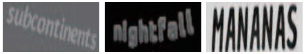|[Scene text datasets(提取码:emco)](https://pan.baidu.com/s/1PBJf-BtFa7mLkltIfTXPhQ)|
|MJSynth|**6 million** synthetic text instances. It's a generation of SynthText.|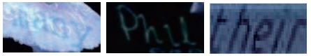|[Scene text datasets(提取码:emco)](https://pan.baidu.com/s/1PBJf-BtFa7mLkltIfTXPhQ)|

## 2.Real Datasets
### 2.1.Benchmarks
- **Benchmark datasets are used to evaluate the performance of a recognizer on real scene**

|Dataset|Description|Examples|BaiduNetdisk link|
|----|----|----|----|
|**IIIT5k-Words(IIIT5K)**|**3000** test images instances. Take from street scenes and from originally-digital images|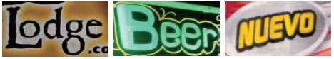|[Scene text datasets(提取码:emco)](https://pan.baidu.com/s/1PBJf-BtFa7mLkltIfTXPhQ)|
|**Street View Text(SVT)**|**647** test images instances. Some images are severely corrupted by noise, blur, and low resolution|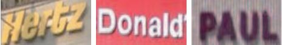|[Scene text datasets(提取码:emco)](https://pan.baidu.com/s/1PBJf-BtFa7mLkltIfTXPhQ)|
|**StreetViewText-Perspective(SVT-P)**|**639** test images instances.  It is specifically designed to evaluate perspective distorted textrecognition. It is built based on the original SVT dataset by selecting the images at the sameaddress on Google Street View but with different view angles. Therefore, most text instancesare heavily distorted by the non-frontal view angle.||[Scene text datasets(提取码:emco)](https://pan.baidu.com/s/1PBJf-BtFa7mLkltIfTXPhQ)|
|**ICDAR 2003(IC03)**|**867** test image instances|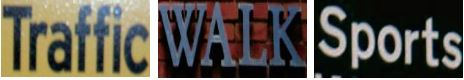|[Scene text datasets(提取码:mfir)](https://pan.baidu.com/s/1PBJf-BtFa7mLkltIfTXPhQ)|
|**ICDAR 2013(IC13)**|**1015** test images instances|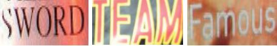|[Scene text datasets(提取码:emco)](https://pan.baidu.com/s/1PBJf-BtFa7mLkltIfTXPhQ)|
|**ICDAR 2015(IC15)**|**2077** test images instances. As text images were taken by Google Glasses without ensuringthe image quality, most of the text is very small, blurred, and multi-oriented|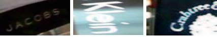|[Scene text datasets(提取码:emco)](https://pan.baidu.com/s/1PBJf-BtFa7mLkltIfTXPhQ)|
|**CUTE80(CUTE)**|**288** It focuses on curved text recognition. Most images in CUTE have acomplex background, perspective distortion, and poor resolution||[Scene text datasets(提取码:emco)](https://pan.baidu.com/s/1PBJf-BtFa7mLkltIfTXPhQ)|
****
### 2.2.Others Labeled Datasets
- **This part is largely copied from [What If We Only Use Real Datasets for Scene Text Recognition? Toward Scene Text Recognition With Fewer Labels](https://openaccess.thecvf.com/content/CVPR2021/html/Baek_What_if_We_Only_Use_Real_Datasets_for_Scene_Text_CVPR_2021_paper.html). Sincerely grateful for their amazing work**
  
|Dataset|Description|Examples|BaiduNetdisk link|
|----|----|----|----|
|**COCO-Text**|**39K** Created from the MS COCO dataset. As the MS COCO dataset is not intended to capture text. COCO contains many occluded or low-resolution texts|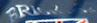|[Others(提取码:DLVC)](https://pan.baidu.com/s/1o-7-zyUnwo44M4P6SzFkpg)|
|**RCTW**|**8186 in English**. RCTW is created for Reading Chinese Text in the Wild competition. We select those in english|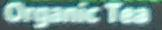|[Others(提取码:DLVC)](https://pan.baidu.com/s/1o-7-zyUnwo44M4P6SzFkpg)|
|**Uber-Text**|**92K**. Collecetd from Bing Maps Streetside. Many are house number, and some are text on signboards|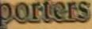|[Others(提取码:DLVC)](https://pan.baidu.com/s/1o-7-zyUnwo44M4P6SzFkpg)|
|**Art**|**29K**. Art is created to recognize Arbitrary-shaped Text. Many are perspective or curved texts. It also includes Totaltext and CTW1500, which contain many rotated or curved texts|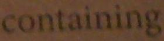|[Others(提取码:DLVC)](https://pan.baidu.com/s/1o-7-zyUnwo44M4P6SzFkpg)|
|**LSVT**|**34K in English**. LSVT is a Large-scale Streeet View Text dataset, collected from streets in China. We select those in english||[Others(提取码:DLVC)](https://pan.baidu.com/s/1o-7-zyUnwo44M4P6SzFkpg)|
|**MLT19**|**46K in English**. MLT19 is created to recognize Multi-Lingual Text. It consists of seven languages:Arabic, Latin, Chinese, Japanese, Korean, Bangla, and Hindi. We select those in english|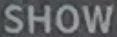|[Others(提取码:DLVC)](https://pan.baidu.com/s/1o-7-zyUnwo44M4P6SzFkpg)|
|**ReCTS**|**23K in English**. ReCTS is created for the Reading Chinese Text on Signboard competition. It contains many irregular texts arranged in various layouts or written with unique fonts. We select those in english|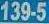|[Others(提取码:DLVC)](https://pan.baidu.com/s/1o-7-zyUnwo44M4P6SzFkpg)|

### 3.Synthetic Engine
- To tired today to do any more updating😫😫😪
